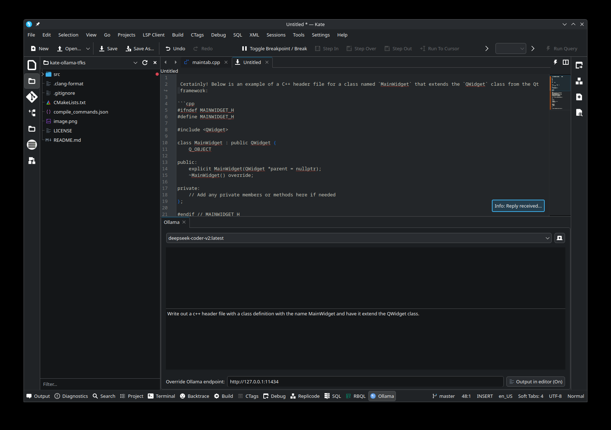

# Kate-Ollama
[](http://www.gnu.org/licenses/gpl-3.0)   

**Experimental** plugin to integrate Ollama in Kate.

Write a text that starts with `// AI: [your prompt]`.

[(Tiny) Video](https://github.com/user-attachments/assets/a26e3b90-9a32-4092-82be-bf874fbd7c4f)

## Commands

* `Ctrl + /`: prints `// AI: `
* `Ctrl + ;`: execute Ollama with the `generate` endpoint, so doesn't have memory of what was already executed
* `Ctrl + Shift + ;`: execute Ollama with the `generate` endpoint, but with the whole content injected before the prompt

## Installation instructions

Build and install:

```
mkdir -p build && cd build
cmake -DCMAKE_BUILD_TYPE=Debug -DCMAKE_INSTALL_PREFIX=/usr -DCMAKE_EXPORT_COMPILE_COMMANDS=1 -G Ninja ../
ninja
ninja install
```

If you are developing a symlink as root can simplify the loading of the latest plugin build:

```
ln -s /your-folder/build/plugins/kf6/ktexteditor/kateollama.so /usr/lib/x86_64-linux-gnu/qt6/plugins/kf6/ktexteditor/kateollama.so
```

## Added functionality in this repo:
Created a tabbed panel which let's the user query Ollama outside of the editor. Still in development but basic functionality is there.

